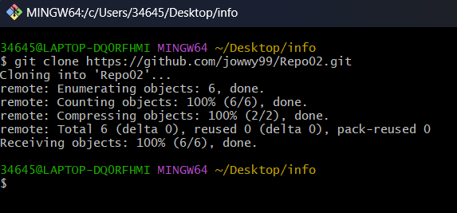

# EJERCICIO 2  
### 2.1 - Crea un repositorio llamado repo02 desde GitHub. ¿Sería considerado un repositorio local o remoto?  
Al crear un repositorio desde Git Hub y añadirme modificaciones se considera un repositorio remoto.

### 2.2 Posteriormente, clónalo (mediante al comando git clone), lo que realizará una copia del repositorio remoto en nuestro equipo, creando con ello un repositorio local a partir del repositorio en remoto

  

### 2-3 - Añade un fichero readme.md y ejecuta los comandos pertinentes hasta llegar a poder realizar un commit

